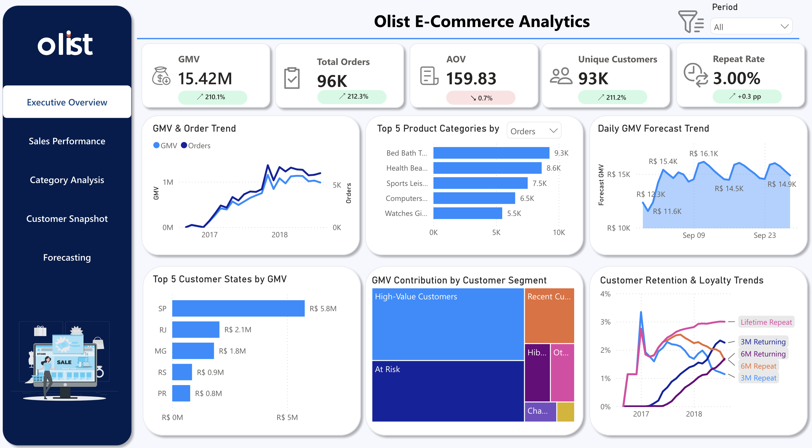
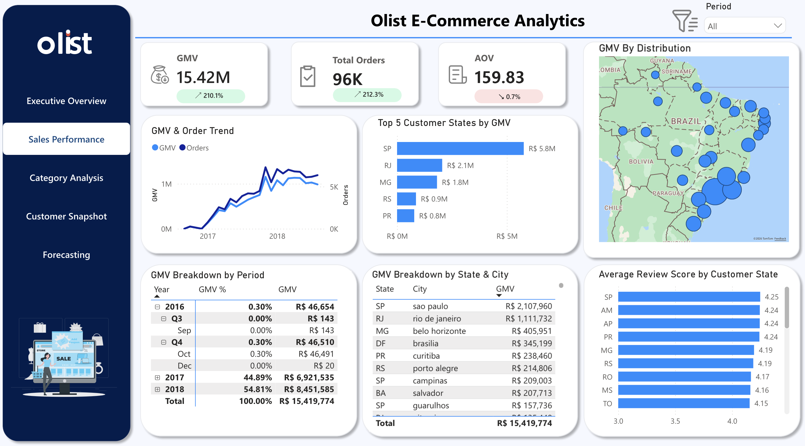
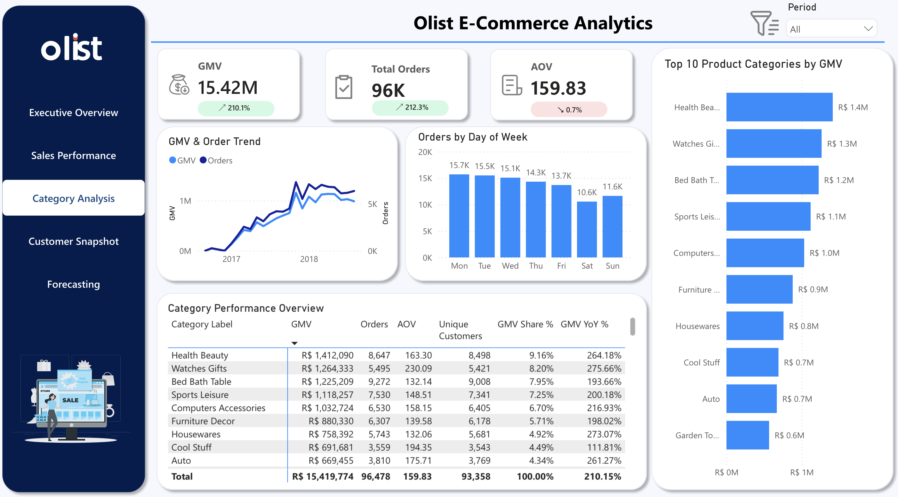
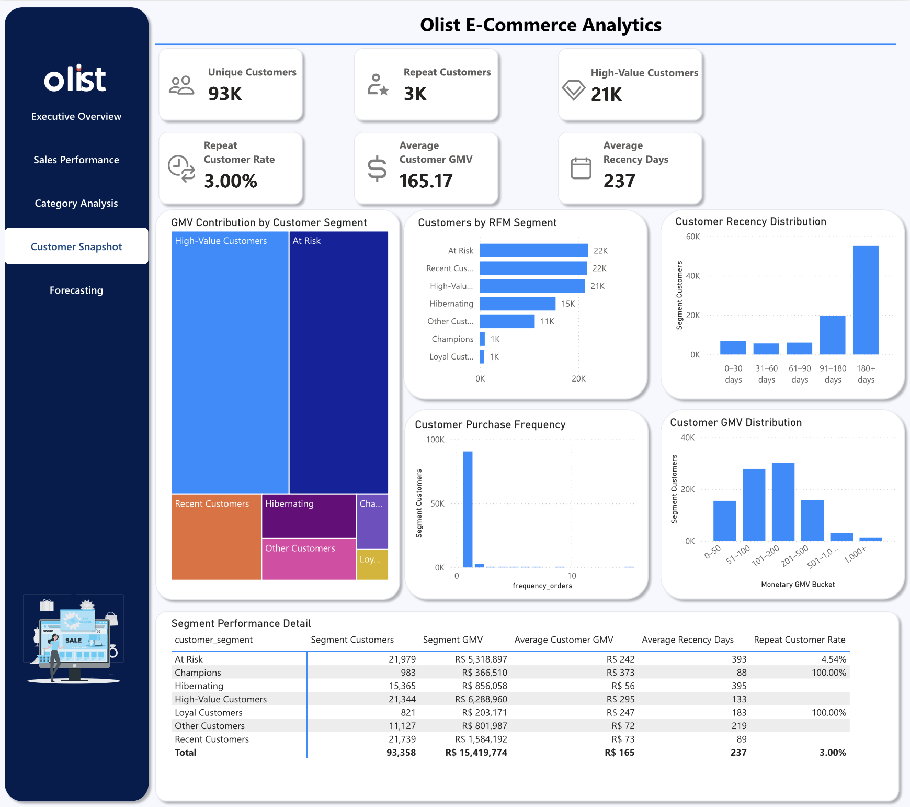
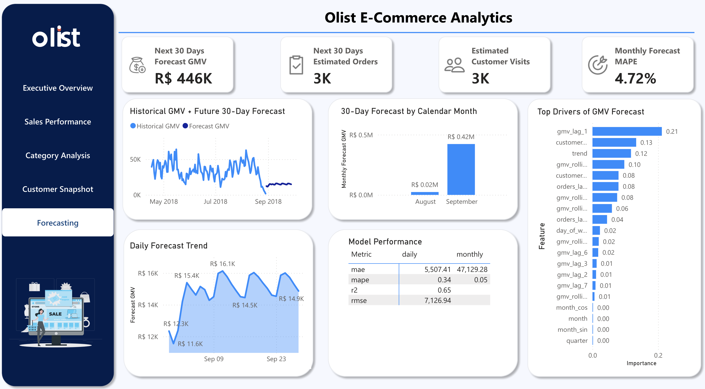
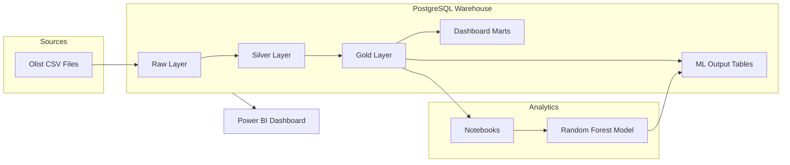
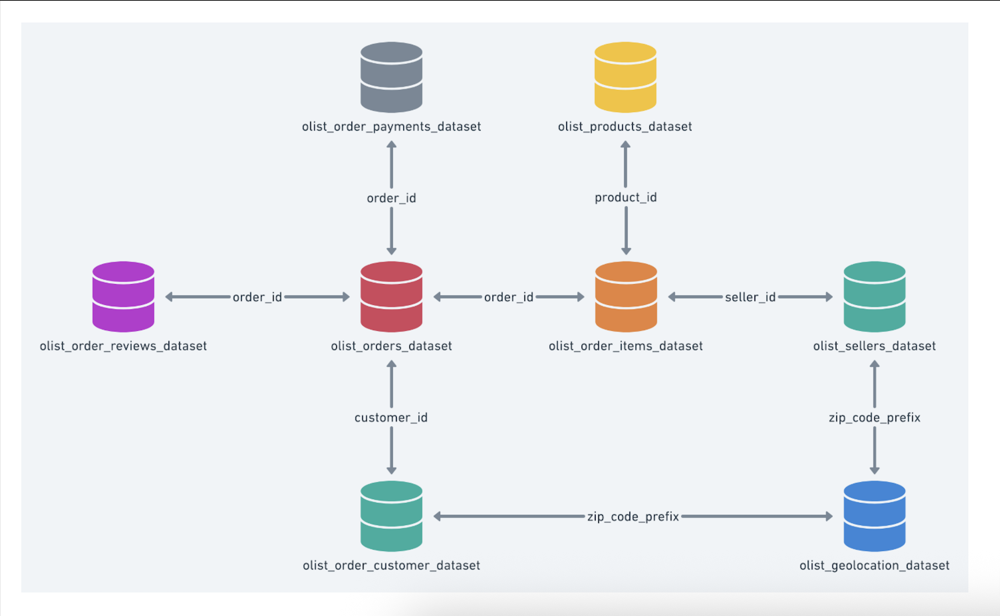
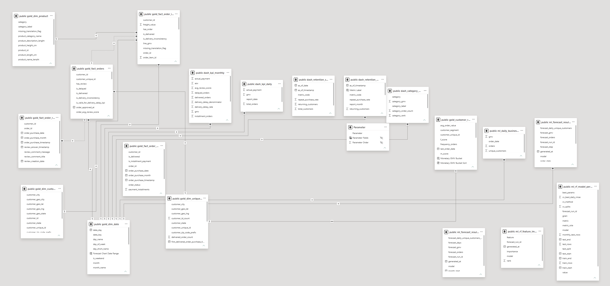

# Olist E-Commerce Analytics

**End-to-end business intelligence platform for the Olist Brazilian e-commerce marketplace, built with PostgreSQL, Python, and Power BI, featuring dimensional modeling, KPI dashboards, customer segmentation, and GMV forecasting.**


**[View Live Dashboard](https://app.powerbi.com/view?r=eyJrIjoiZTMzZTNhMjUtZjBkYS00NWUyLWJiMmYtOGE0MTBhZDliMmU5IiwidCI6IjI2Y2NmYmI0LTc4MTYtNGY0My1hMjM2LWI2ZmZmYjg0Y2ZjMSIsImMiOjEwfQ%3D%3D)** · **[PDF Report](reports/ecommerce_dashboard_v2.pdf)**

*Raw → Silver → Gold → Dashboard marts → ML forecast → 5-page Power BI report*

---

## Dashboard Preview

  
*Executive Overview*


| Sales Performance                                                  | Category Analysis                                                  |
| ------------------------------------------------------------------ | ------------------------------------------------------------------ |
|  |  |


| Customer Snapshot                                                  | Forecasting                                            |
| ------------------------------------------------------------------ | ------------------------------------------------------ |
|  |  |


---

## Overview

This project delivers a production-style analytics stack on the **Olist Brazilian E-Commerce Dataset** — covering orders, customers, products, payments, reviews, and geolocation across **Sep 2016 – Aug 2018**.

The pipeline transforms **9 raw CSVs (~1.55M rows)** into a **33-table PostgreSQL warehouse** (raw / silver / gold / dashboard / ML), validates **9 KPIs** in Python, trains a time-series **Random Forest** model for daily GMV (**~4.7% monthly MAPE** on the last 3-month holdout), and surfaces insights through a **5-page Power BI dashboard**.


| Dimension               | Scope                                                                    |
| ----------------------- | ------------------------------------------------------------------------ |
| **Source records**      | **~1.55M rows** across 9 Olist tables                                    |
| **Warehouse tables**    | **33 tables** across raw · silver · gold · dashboard · ML                |
| **SQL pipeline**        | **7 scripts** (DDL, load, validation, silver, gold, dashboard, ML)       |
| **Orders analyzed**     | **99,441** orders · **96,478** delivered · **112,650** order items       |
| **Customers & catalog** | **99,441** customers · **32,951** products · **3,095** sellers           |
| **KPIs tracked**        | **9** core business metrics                                              |
| **Forecast model**      | Daily GMV · **30-day** horizon · **~4.7% monthly MAPE** (holdout)        |
| **Dashboard**           | **5 pages** — Overview · Sales · Category · Customer · Forecast          |


---

## Architecture




  
*Warehouse star schema (gold layer facts and dimensions).*

  
*Power BI relationship model used by the report.*

### Layer Design


| Layer         | Purpose                                 | Key Objects                                                                    |
| ------------- | --------------------------------------- | ------------------------------------------------------------------------------ |
| **Raw**       | Source-of-truth CSV loads               | `raw_olist_`* tables                                                           |
| **Silver**    | Cleansed, deduplicated, joined entities | `silver_olist_orders_dataset`, `silver_products_join_category_translation`     |
| **Gold**      | Conformed star schema for analysis      | `gold_fact_orders`, `gold_fact_order_items`, `gold_dim_`*, `gold_customer_rfm` |
| **Dashboard** | Pre-aggregated KPI marts for BI         | `dash_kpi_monthly`, `dash_category_monthly`, `dash_retention_`*                |
| **ML**        | Forecast outputs and model metadata     | `ml_forecast_result_daily`, `ml_rf_model_performance`                          |


---

## Key Capabilities

### Business Intelligence

- **Executive KPI cards** — GMV, Orders, AOV, Unique Customers, and Repeat Purchase Rate with YoY badges
- **Time intelligence** — Year / month slicers with dynamic measure context
- **Category analytics** — Top-N ranking by GMV or order volume, filterable by region
- **Geographic distribution** — State / city GMV maps and review score comparisons
- **Customer retention** — Lifetime, 3-month, and 6-month returning and repeat purchase metrics
- **RFM segmentation** — Score customers on Recency / Frequency / Monetary, then classify into 7 segments (Champions, Loyal, High-Value, Recent, At Risk, Hibernating, Other)

### Machine Learning

Time-series forecasting for daily GMV:

- **Feature engineering** — Build feature vectors from GMV lags (1/2/3/6/7-day), orders/customers lags (1/7-day), rolling means/std, and calendar signals (`shift(1)` to avoid leakage)
- **Daily GMV forecasting** — `RandomForestRegressor` trained on the engineered time-series features
- **Time-series cross-validation** — `TimeSeriesSplit` tuning; holdout = last 3 calendar months
- **Recursive 30-day horizon** — Multi-step forecast with derived orders and customer estimates
- **Model governance** — Performance metrics and feature importance exported to SQL tables

---

## KPI Framework

All metrics follow a shared delivered-order filter and are documented in `[docs/kpi_definitions.md](docs/kpi_definitions.md)`.


| #   | KPI                      | Formula                                         |
| --- | ------------------------ | ----------------------------------------------- |
| 1   | **GMV**                  | `SUM(price + freight_value)`                    |
| 2   | **Total Orders**         | `COUNT(DISTINCT order_id)`                      |
| 3   | **AOV**                  | GMV ÷ Total Orders                              |
| 4   | **Repeat Purchase Rate** | 5 retention metrics (lifetime / 3m / 6m)        |
| 5   | **Delivery Delay Rate**  | Delayed orders ÷ valid delivered orders         |
| 6   | **Average Review Score** | `AVG(review_score)`                             |
| 7   | **Installment Usage**    | Orders with installments > 1 ÷ delivered orders |
| 8   | **Actual Payment**       | `SUM(payment_value)`                            |
| 9   | **Top Category GMV**     | GMV by product category                         |


---

## Tech Stack


| Category           | Tools                                                       |
| ------------------ | ----------------------------------------------------------- |
| **Database**       | PostgreSQL                                                  |
| **ETL / Modeling** | SQL (table DDL + ETL transforms)                            |
| **Analysis**       | Python, Pandas, Jupyter                                     |
| **ML**             | scikit-learn (Random Forest, GridSearchCV, TimeSeriesSplit) |
| **Visualization**  | Power BI Desktop                                            |
| **Config**         | python-dotenv, SQLAlchemy                                   |


---

## Project Structure

```
ecommerce-bi-dashboard/
├── README.md
├── requirements.txt
├── data_structure.png       # Warehouse schema diagram
├── data/
│   ├── raw/                 # Olist source CSVs
│   ├── processed/           # Intermediate notebook exports
│   └── output/              # Forecast & model output CSVs
├── sql/
│   ├── 01_create_raw_tables.sql
│   ├── 02_load_raw_data.sql
│   ├── 03_data_validation.sql
│   ├── 04_create_silver_tables.sql
│   ├── 05_create_gold_tables.sql
│   ├── 06_create_dashboard_tables.sql
│   └── 07_create_ml_output_tables.sql
├── notebooks/
│   ├── 01_pandas_eda.ipynb
│   ├── 02_kpi_testing.ipynb
│   ├── 03_forecasting_ml.ipynb
│   └── 04_business_insights.ipynb
├── src/
│   ├── __init__.py
│   ├── config.py            # Environment & path configuration
│   ├── extract_api.py       # Optional API extract helpers
│   ├── load_to_postgres.py  # Optional Python loader
│   └── forecast_pipeline.py
├── powerbi/
│   ├── README.md
│   ├── ecommerce_dashboard_v2.pbix
│   └── screenshots/         # Report pages + data model
├── reports/
│   ├── README.md
│   └── ecommerce_dashboard_v2.pdf
└── docs/
    ├── business_understanding.md
    ├── data_dictionary.md
    ├── kpi_definitions.md
    └── final_presentation.md
```

---

## Getting Started

### Prerequisites

- Python 3.10+
- PostgreSQL 14+
- Power BI Desktop (for local `.pbix` editing)
- Olist dataset CSVs placed in `data/raw/`

### 1. Clone & Install

```bash
git clone https://github.com/Sherry-max33/ecommerce-bi-dashboard.git
cd ecommerce-bi-dashboard

python -m venv .venv
source .venv/bin/activate        # Windows: .venv\Scripts\activate
pip install -r requirements.txt
```

### 2. Configure Environment

Create a `.env` file in the project root:

```env
POSTGRES_HOST=localhost
POSTGRES_PORT=5432
POSTGRES_DB=ecommerce
POSTGRES_USER=your_user
POSTGRES_PASSWORD=your_password
```

### 3. Build the Warehouse

Run SQL scripts in order from the project root:

```bash
psql -d ecommerce -f sql/01_create_raw_tables.sql
psql -d ecommerce -f sql/02_load_raw_data.sql
psql -d ecommerce -f sql/03_data_validation.sql
psql -d ecommerce -f sql/04_create_silver_tables.sql
psql -d ecommerce -f sql/05_create_gold_tables.sql
psql -d ecommerce -f sql/06_create_dashboard_tables.sql
```

Or use the Python loader:

```bash
python -m src.load_to_postgres
```

### 4. Run Analytics Notebooks

Execute notebooks sequentially:


| Notebook                     | Description                                     |
| ---------------------------- | ----------------------------------------------- |
| `01_pandas_eda.ipynb`        | Exploratory analysis on gold / dashboard tables |
| `02_kpi_testing.ipynb`       | Validate KPI calculations against SQL marts     |
| `03_forecasting_ml.ipynb`    | Train RF model, generate 30-day forecast        |
| `04_business_insights.ipynb` | Strategic recommendations and narrative         |


After forecasting, load ML outputs:

```bash
psql -d ecommerce -f sql/07_create_ml_output_tables.sql
```

> **Tip:** Notebooks are committed without cell outputs. Strip outputs before pushing:
>
> ```bash
> pip install nbstripout
> nbstripout notebooks/*.ipynb
> nbstripout --install   # optional: auto-strip on commit
> ```

### 5. Open the Dashboard


| Asset             | Link / Path                                                                                                                                                                               |
| ----------------- | ----------------------------------------------------------------------------------------------------------------------------------------------------------------------------------------- |
| **Live report**   | [Power BI Dashboard](https://app.powerbi.com/view?r=eyJrIjoiZTMzZTNhMjUtZjBkYS00NWUyLWJiMmYtOGE0MTBhZDliMmU5IiwidCI6IjI2Y2NmYmI0LTc4MTYtNGY0My1hMjM2LWI2ZmZmYjg0Y2ZjMSIsImMiOjEwfQ%3D%3D) |
| **PDF report**    | `[reports/ecommerce_dashboard_v2.pdf](reports/ecommerce_dashboard_v2.pdf)`                                                                                                                |
| **Local** `.pbix` | `powerbi/ecommerce_dashboard_v2.pbix`                                                                                                                                                     |
| **Screenshots**   | `[powerbi/screenshots/](powerbi/screenshots/)`                                                                                                                                            |


To edit locally:

1. Open `powerbi/ecommerce_dashboard_v2.pbix` in Power BI Desktop
2. Connect to PostgreSQL (`ecommerce` database)
3. Refresh data and explore the five report pages

See `[powerbi/README.md](powerbi/README.md)` for page map and screenshot naming.

---

## Forecasting Methodology

The ML pipeline (`03_forecasting_ml.ipynb`) follows a rigorous time-series workflow:

1. **Export** daily delivered-order metrics (GMV, orders, unique customers)
2. **Engineer** lag features (1/2/3/6/7-day) and rolling statistics with `shift(1)` to prevent leakage
3. **Tune** Random Forest via `GridSearchCV` + `TimeSeriesSplit` on the training set
4. **Evaluate** on a holdout of the last 3 calendar months (daily RMSE primary; monthly MAE/MAPE for business view)
5. **Forecast** 30 days recursively; derive orders and customers from recent AOV and customer-per-order ratios


| Output             | Location                                                                 |
| ------------------ | ------------------------------------------------------------------------ |
| Daily forecast     | `data/output/forecast_result_daily.csv` → `ml_forecast_result_daily`     |
| Monthly rollup     | `data/output/forecast_result_monthly.csv` → `ml_forecast_result_monthly` |
| Model performance  | `data/output/rf_model_performance.csv` → `ml_rf_model_performance`       |
| Feature importance | `data/output/rf_feature_importance.csv` → `ml_rf_feature_importance`     |


---

## Documentation


| Document                                                           | Description                                |
| ------------------------------------------------------------------ | ------------------------------------------ |
| `[docs/kpi_definitions.md](docs/kpi_definitions.md)`               | Formal KPI specs with formulas and filters |
| `[docs/data_dictionary.md](docs/data_dictionary.md)`               | Table and column reference                 |
| `[docs/business_understanding.md](docs/business_understanding.md)` | Stakeholders, questions, success criteria  |
| `[docs/final_presentation.md](docs/final_presentation.md)`         | Presentation outline and demo checklist    |
| `[powerbi/README.md](powerbi/README.md)`                           | Live link, pages, screenshots              |
| `[reports/README.md](reports/README.md)`                           | PDF report deliverable                     |


